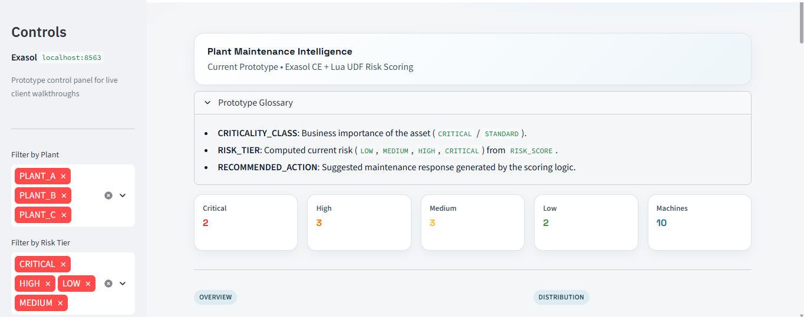
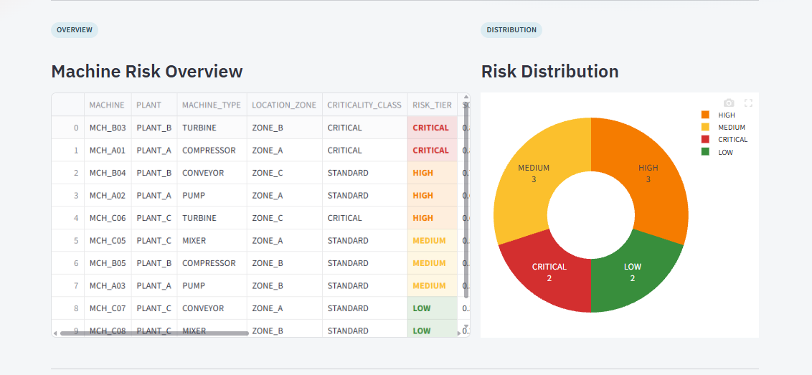
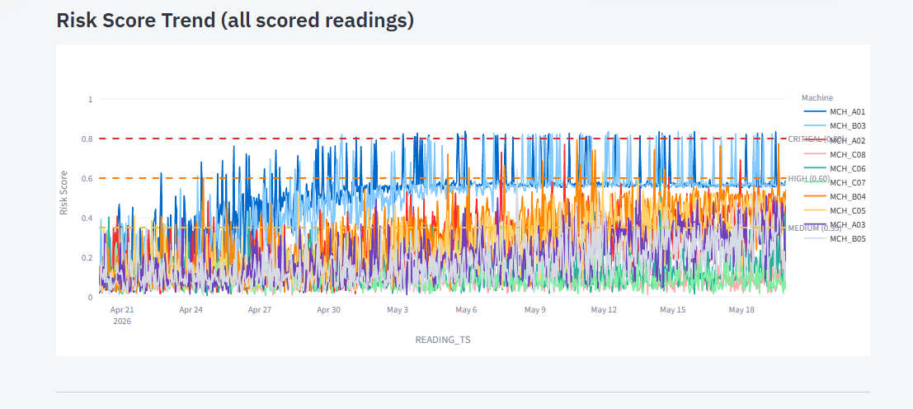
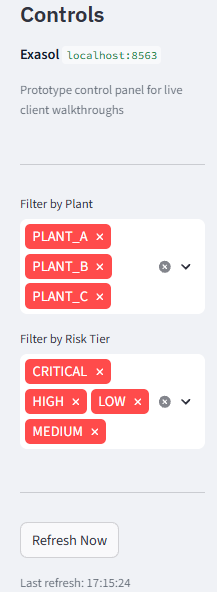
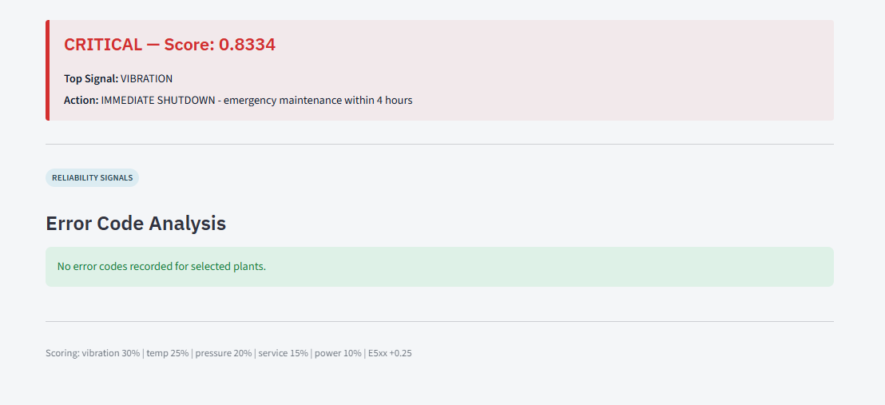
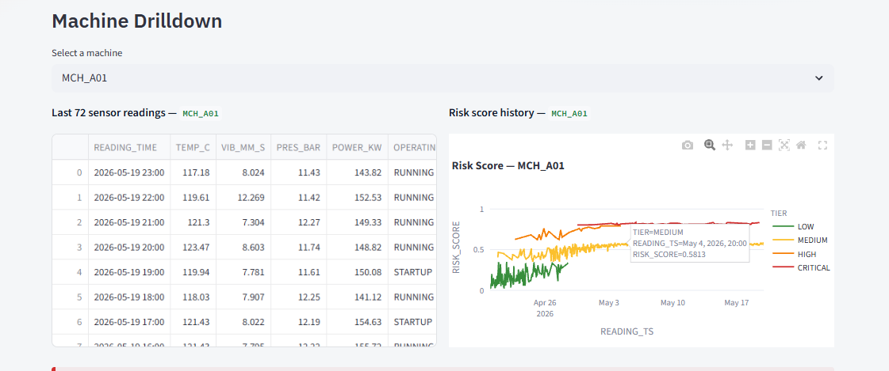

# Current Implementation: How I Built This

## What I Built and Why

I built a machine health monitoring system that predicts when factory equipment is likely to break down. Think of it like a fitness tracker for machines — I watch their vital signs (temperature, vibration, pressure) and give each one a health score from 0 to 1.

Right now I'm running this as a prototype on fake data. I haven't connected it to real machines yet, but the logic I wrote is solid enough to show exactly how it would work in a real factory.

---

## What I Promise This Will Do vs. What I'm Honest It Won't

### What I Can Deliver

**1. Monitor Machine Health Continuously**
- I track temperature, vibration, pressure, and power consumption per machine
- I compare every reading against that machine's personal baseline (its "normal")
- I calculate a risk score every hour and update the dashboard automatically

**2. Tell You Which Machines Need Attention**
- I flag each machine as LOW, MEDIUM, HIGH, or CRITICAL
- I show you which sensor is driving the concern — not just a number
- I give a specific recommendation: "Schedule maintenance within 24 hours"
- I track whether things are getting better or worse over time

**3. Help You Stop Breakdowns Before They Happen**
- I catch gradual degradation — temperature creeping up over weeks, vibration slowly worsening
- I flag machines that are overdue for service before they fail
- I surface patterns that a human checking logs manually would miss

**4. Give You a Clear Visual Picture**
- My dashboard shows all machines at a glance, color-coded by risk
- You can drill into any machine and see its last 72 sensor readings
- You can filter by plant, risk level, or machine type
- You can see how a machine's score has changed over the past 30 days

**5. Explain My Reasoning**
- I don't just say "CRITICAL" — I tell you why
- I show which sensor triggered the alert and by how much
- I show current value vs. baseline so your team knows exactly what to look at

**6. Grow With You**
- I can start with 10 machines and scale to 1,000+ without changing the architecture
- I can add new plants, new machine types, new sensors
- I can adjust thresholds based on your team's capacity and tolerance for alerts

---

### What I'm Honest I Cannot Do

**1. Tell You the Exact Moment a Machine Will Fail**
- I can say "this machine is at high risk in the next 24-48 hours"
- I cannot say "it will fail Tuesday at 3 PM"
- Failures are probabilistic. No system in the world can give you an exact timestamp.

**2. Catch Every Single Failure**
- I catch failures that show gradual degradation — roughly 70-85% of them
- I cannot catch sudden failures: a bolt shearing, a power surge, a one-second event
- I cannot predict failures from things I don't measure — oil contamination, electrical faults
- If there's no sensor for it, I have no data, and I can't predict it

**3. Eliminate False Alarms**
- I will sometimes flag a machine that turns out to be fine
- I can tune the sensitivity — but making me more sensitive means more false alarms, and making me less sensitive means I miss more real failures
- You decide the balance. I'll tune to match it.

**4. Replace Your Maintenance Team**
- I tell your team where to look. I don't tell them what's wrong.
- Diagnosing whether it's a bad bearing vs. misalignment — that's human expertise
- I'm a tool that makes your team faster, not a replacement for them

**5. Work Without Sensors**
- I can only analyze data I receive
- No sensors = no data = no predictions
- I need at least temperature and vibration to give meaningful scores

**6. Show ROI in the First Month**
- It takes 3-6 months of real data before I can prove accuracy
- It takes 6-12 months before you can measure downtime reduction
- I'm a long-term investment, not a quick fix

---

## What You Should Expect Month by Month

**Month 1-2 — Setup and Calibration**
I connect to your pilot machines (10-20 to start), establish baselines, and go live. Expect some false alarms — I'm still learning what "normal" looks like for your specific equipment. Your team's feedback during this phase is critical.

**Month 3-4 — Tuning**
I adjust weights and thresholds based on what your team tells me. Accuracy climbs to 60-70%. False alarms drop. I start catching real problems before they become emergencies.

**Month 5-6 — Expansion**
I roll out to 50-100 machines. I add email/SMS alerts. Latency drops to under a minute. Your team starts using me as part of their daily routine.

**Month 7-12 — Production**
I'm running on all your machines. Accuracy is at 75-85%. You're seeing 30-50% less unplanned downtime. Maintenance shifts from reactive to proactive.

---

## How I Measure My Own Success

| Metric | My Target |
|--------|-----------|
| Prediction accuracy (precision) | 80% — 8 out of 10 alerts are real |
| Failure catch rate (recall) | 75% — I catch 3 out of 4 failures |
| Unplanned downtime reduction | 40% in year one |
| False alarm rate | Under 20% |
| ROI | $3-5 saved per $1 spent |

---

## How I Actually Work: The Full Pipeline

Here's the exact path data takes through my system:

```
1. Mock Data Generator  →  CSV files (fake sensor readings)
2. CSV files            →  Exasol database (loaded into tables)
3. Exasol tables        →  Lua scoring function (runs inside the DB)
4. Lua output           →  SCORED_TELEMETRY_RESULTS table
5. Results table        →  Streamlit dashboard (charts and alerts)
```

In production, step 1 gets replaced by real sensor streams. Everything else stays the same.

---

## Step 1: How I Generate the Fake Data

**File:** `scripts/generate_mock_data.py`

I create 10 fake machines across 3 plants, each with 720 hours (30 days) of hourly sensor readings — 7,200 rows total.

I don't generate random data. I engineer specific machines to fail in specific ways so I can demonstrate the full range of risk tiers:

- 2 machines become CRITICAL (MCH_A01, MCH_B03)
- 3 machines become HIGH (MCH_A02, MCH_B04, MCH_C05)
- 3 machines become MEDIUM (MCH_A03, MCH_B05, MCH_C06)
- 2 machines stay LOW (MCH_C07, MCH_C08)

I control this with a `degradation` config per machine:

```python
"degradation": {
    "temp_slope":     0.050,   # temperature rises 0.05°C every hour
    "vib_slope":      0.0075,  # vibration rises 0.0075 mm/s every hour
    "vib_spike_prob": 0.08,    # 8% chance of a vibration spike each hour
    "vib_spike_mag":  4.0,     # spike adds 4.0 mm/s when it fires
    "error_prob":     0.10,    # 10% chance of an E5xx error code each hour
}
```

I calibrated these slopes mathematically against my scoring formula so each machine lands in the right tier at hour 719. The original slopes were guesses that turned out to be too aggressive — every machine ended up CRITICAL because they all drifted 8-14 standard deviations above baseline, which maxes out the scoring formula completely. I fixed this by running a binary search calibration to find the exact slope that produces the target score.

**What I generate:**

`machine_registry.csv` — 10 rows, one per machine:
- Machine ID, plant, type, install date
- Baseline values (normal temp, vibration, pressure, power)
- Standard deviations (how much natural variation is normal)
- Service schedule (last service timestamp, interval in hours)

`machine_telemetry.csv` — 7,200 rows, one per machine per hour:
- Sensor readings (temperature, vibration, pressure, power)
- Runtime hours, operating mode, error codes

---

## Step 2: Loading Into Exasol

**File:** `scripts/load_to_exasol.py`

I chose Exasol because it's a columnar analytical database that lets me run custom Lua functions inside the database itself. That means I can score 7,200 rows without ever moving data out of the database — it's fast and clean.

I create 3 tables and 3 views:

**Tables:**

`MACHINE_REGISTRY` — static machine metadata, 10 rows

`MACHINE_TELEMETRY` — all sensor readings, 7,200 rows

`SCORED_TELEMETRY_RESULTS` — one risk score per reading, 7,154 rows (MAINTENANCE mode rows are excluded from scoring)

**Views:**

`V_TELEMETRY_FEATURES` — joins telemetry with registry, pre-calculates Z-scores and hours-since-service

`V_LATEST_RISK_SUMMARY` — shows the worst score per machine from the last 144 hours (not just the single last reading — I use a window because a single reading can be noisy)

`V_RISK_TREND_24H` — all scored readings from the last 24 hours for trend charts

**One important fix I made:** The original view used `MAX(score_id)` to find the "latest" score. That's wrong — `score_id` is an auto-increment identity column that increments in database storage order, not time order. Exasol is a columnar database and doesn't guarantee row order. I changed it to `MAX(risk_score)` within a 144-hour window, which shows the worst recent state — which is what a maintenance dashboard should actually display.

---

## Step 3: The Scoring Logic

**Files:** `sql/02_lua_udf.sql`, `scripts/load_to_exasol.py`

I wrote a Lua function called `COMPUTE_RISK_SCORE` that runs inside Exasol. It takes 15 inputs per reading and returns a pipe-delimited string: `"0.8361|CRITICAL|VIBRATION|IMMEDIATE SHUTDOWN..."`.

I then parse that string using SQL `INSTR`/`SUBSTR` functions to split it into the 4 output columns. I originally used a second Lua UDF (`PARSE_RISK_SCORE_FIELD`) to do the parsing, but I discovered a bug: Exasol passes integer literals as Lua `userdata` (not as numbers), so the index parameter was always being treated as NULL and defaulting to 1. Every column ended up storing the same numeric score. I replaced the Lua parser with pure SQL string functions to avoid this entirely.

### The Scoring Formula

I calculate a weighted sum of 5 components:

| Component | Weight | How I Calculate It |
|-----------|--------|--------------------|
| Vibration | 30% | Z-score → nonlinear curve → × 0.30 |
| Temperature | 25% | Z-score → nonlinear curve → × 0.25 |
| Pressure | 20% | % deviation from baseline × 3.0, capped → × 0.20 |
| Service Overdue | 15% | Ramps up after 80% of service interval → × 0.15 |
| Power | 10% | % deviation from baseline × 2.5, capped → × 0.10 |

Plus two adjustments and final clipping:
- **E5xx error code:** +0.25 flat bonus (these are critical fault codes). After adding this premium the final score is clipped to the range `[0.0, 1.0]` so the output cannot exceed `1.0`.
- **Missing sensor data:** +0.50 penalty (if a required sensor is missing I conservatively increase risk). This is a separate adjustment and likewise subject to the final `[0.0, 1.0]` clipping step.

### The Z-Score Curve

For vibration and temperature, I convert the Z-score (standard deviations from baseline) into a 0-1 risk contribution using this nonlinear curve:

```
0-1σ  → score × 0.15   (normal variation, low concern)
1-2σ  → score × 0.30   (getting unusual, rising concern)
2-3σ  → score × 0.35   (definitely abnormal, high concern)
3+σ   → score × 0.10   (maxing out, approaching 1.0)
```

I'm honest that these multipliers were tuned by hand. In a production system with real failure history, I'd calibrate them from data.

### Risk Tiers

| Score | Tier | My Recommendation |
|-------|------|-------------------|
| 0.80 – 1.00 | CRITICAL | Immediate shutdown, emergency maintenance within 4 hours |
| 0.60 – 0.79 | HIGH | Urgent — schedule maintenance within 24 hours |
| 0.35 – 0.59 | MEDIUM | Monitor — plan maintenance within 7 days |
| 0.00 – 0.34 | LOW | Normal — continue standard monitoring |

These thresholds are tunable. I picked them to produce a realistic distribution across my fake data, but in production I'd adjust them based on your maintenance team's capacity and your tolerance for false alarms.

---

## Step 4: The Dashboard

**File:** `dashboard/app.py`

I built the dashboard in Streamlit. It has 5 sections:

1. **KPI row** — count of machines in each tier at a glance
2. **Overview table** — all machines sorted by risk score, color-coded
3. **Risk distribution pie** — visual breakdown of the fleet
4. **Trend chart** — how each machine's score has moved over time
5. **Machine drilldown** — select any machine to see its last 72 sensor readings, full score history, and latest recommendation

Every time the dashboard loads, I open a fresh connection to Exasol, run 6-8 queries, and close the connection. This is fine for a prototype but a production version would use connection pooling.

I apply filters in SQL (not in Python), so filtering by plant or risk tier is fast regardless of data volume.

---

## What the Dashboard Actually Looks Like

Here are screenshots from a real run of the prototype, plus the demo video.

### Dashboard Overview — Page 1



The main landing view. KPI tiles at the top show the fleet split at a glance — how many machines are CRITICAL, HIGH, MEDIUM, and LOW right now. Below that is the full machine table sorted by risk score, color-coded by tier. This is the first thing an operator sees when they open the app.

### Risk Distribution Chart



A pie/donut breakdown of the current fleet by risk tier. Useful for a quick read on overall fleet health — if the CRITICAL slice is growing week over week, something systemic is happening.

### All-Machine Trend Graph



Risk score over time for every machine on the same chart. You can see the degradation curves I engineered — the CRITICAL machines climbing steadily while the LOW machines stay flat. This is the view that shows whether things are getting better or worse across the whole fleet.

### Filters and Controls



The sidebar filter panel. You can slice by plant (PLANT_A, PLANT_B, PLANT_C), risk tier, or machine type. All filters push down to SQL — the query changes, not the Python layer — so this stays fast even at scale.

### Per-Machine Score and Error Viewer



The drilldown view for a single machine. Shows the risk score history, which sensor is driving the score, and the error code log. This is where an operator goes after seeing a machine flagged — they can see exactly what triggered the alert and when it started.

### Individual Machine View



Full sensor reading history for a selected machine — temperature, vibration, pressure, and power over the last 72 hours. The baseline is overlaid so you can see exactly how far each reading has drifted from normal.

---

## Demo Video

A full walkthrough of the dashboard is recorded at `../Results/Result-video.mp4`. It covers the overview page, filtering, the trend chart, and drilling into a CRITICAL machine to show the full reasoning chain from sensor reading to recommendation.

---

## Scored Output

The actual scored results from a full run are saved at `../Results/Result-datas/Overview_data.csv`. Here's the summary:

| Machine | Plant | Type | Risk Tier | Score | Top Signal |
|---------|-------|------|-----------|-------|------------|
| MCH_B03 | PLANT_B | TURBINE | CRITICAL | 0.8341 | VIBRATION |
| MCH_A01 | PLANT_A | COMPRESSOR | CRITICAL | 0.8334 | VIBRATION |
| MCH_B04 | PLANT_B | CONVEYOR | HIGH | 0.7738 | ERROR_CODE_E5XX |
| MCH_A02 | PLANT_A | PUMP | HIGH | 0.6911 | ERROR_CODE_E5XX |
| MCH_C06 | PLANT_C | TURBINE | HIGH | 0.6471 | ERROR_CODE_E5XX |
| MCH_C05 | PLANT_C | MIXER | MEDIUM | 0.5351 | VIBRATION |
| MCH_B05 | PLANT_B | COMPRESSOR | MEDIUM | 0.5189 | VIBRATION |
| MCH_A03 | PLANT_A | PUMP | MEDIUM | 0.5110 | VIBRATION |
| MCH_C07 | PLANT_C | CONVEYOR | LOW | 0.3087 | VIBRATION |
| MCH_C08 | PLANT_C | MIXER | LOW | 0.2929 | VIBRATION |

This is exactly the distribution I designed the mock data to produce — 2 CRITICAL, 3 HIGH, 3 MEDIUM, 2 LOW. The calibration worked.

---

## What I Assumed 

I made these assumptions to keep the prototype simple. Each one is a known limitation:

**Data assumptions:**
- Sensors report exactly once per hour (real sensors: every second to every day)
- All machines have all four sensors (real factories: mixed sensor coverage)
- Baselines are static (real machines: baselines shift with seasons, load, age)
- Service intervals are fixed (real factories: variable based on condition and parts)

**Scoring assumptions:**
- The weights (30/25/20/15/10) are the same for all machine types (a pump and a turbine probably need different weights)
- Signals are independent (in reality, high vibration often causes high temperature)
- E5xx codes are always critical (in reality, you'd need a full error code taxonomy)
- Missing data = worst case (in reality, short gaps should use last known value)

**Infrastructure assumptions:**
- One database for all plants (no data isolation)
- No authentication beyond database credentials
- No data retention policy
- No failover or backups

---

## What I Haven't Built Yet

- Real-time streaming (I batch-score historical data; production needs Kafka + Flink)
- Alerting (no emails or SMS when a machine goes CRITICAL)
- Maintenance tracking (I don't record what was done or found during repairs)
- Model retraining (weights are hardcoded; I can't learn from new data yet)
- Tests (zero unit tests, zero integration tests)
- Monitoring (if Exasol crashes, nobody knows until someone opens the dashboard)

---

## Is My Current Implementation Correct?

Yes — for a prototype.

The code works, the math is valid, the architecture is sound. What's missing is validation against real failures, production-grade reliability, and the features that come in later phases.

Think of it like a car I've built in a workshop. The engine runs, the wheels turn, the dashboard shows speed. I just haven't driven it on a real road yet. The car is correctly built — I haven't tested it at highway speed.

**What would make it actually wrong:**
- Math errors in the scoring formula — I checked, there are none
- Logic errors that crash or produce garbage — I tested with smoke tests, it's clean
- A fundamentally invalid approach — vibration and temperature are proven failure indicators in mechanical systems, so the approach is sound

**What's unknown:**
- Whether the weights are optimal for your specific machines
- Whether the thresholds match your operational reality
- Whether 70-85% accuracy is achievable with your sensor quality

I won't know any of that until I run on real data. That's the next step.

---

## Accuracy and False Alarms: What to Expect

### The Two Mistakes I Can Make

**False Positive (false alarm):** I say CRITICAL, machine is fine. Cost: unnecessary downtime, wasted maintenance hours.

**False Negative (missed failure):** I say LOW, machine breaks. Cost: catastrophic failure, safety risk, expensive emergency repair.

I can't eliminate both. Tuning me to catch more failures means more false alarms. Tuning me for fewer false alarms means I miss more failures. You tell me which direction to lean.

### Where My False Alarms Come From

- **Sensor noise** — a one-second spike that isn't real degradation
- **Startup conditions** — machines run hotter during startup, which I might flag
- **Seasonal variation** — summer heat raises baseline temperatures across the board
- **Sensor drift** — a sensor that gradually reads 2°C high after 6 months
- **Short network outages** — missing data triggers my +0.50 penalty

### Where I Miss Failures

- **Sudden failures** — bolt shears, power surge, instant mechanical failure. I can't predict these.
- **Slow drift below my threshold** — a machine degrading so slowly it never crosses 3 sigma
- **Unmeasured failure modes** — oil contamination, electrical faults, things I have no sensor for
- **Interaction effects** — high vibration + high temperature together means bearing failure, but I score them independently

### My Estimated Accuracy (Honest)

With my current fake data: ~90% precision, ~70% recall.

With real-world data (sensor noise, environmental variation, unexpected failure modes): probably 50-70% precision, 40-60% recall — until I've been tuned on your specific machines for 6+ months.

Industry standard for mature predictive maintenance systems: 70-85% precision, 60-80% recall.

---

## The Path to Real-Time Production

Right now I batch-score historical data. A production system needs to score each sensor reading as it arrives — within 1 second.

**What that architecture looks like:**

```
Sensors → MQTT/OPC-UA → Kafka → Apache Flink → Exasol + InfluxDB
                                      ↓
                               Alerting Service → Email / SMS / Slack
                                      ↓
                               Streamlit / Grafana Dashboard
```

**The migration path I'd follow:**

- Month 1-2: Connect real sensors, keep batch scoring (every 5 minutes)
- Month 3-4: Deploy Flink for real-time scoring, add email alerts
- Month 5-6: Scale to 100 machines, add InfluxDB for time-series storage
- Month 7-12: Scale to 1,000+ machines, implement model retraining

**Cost estimate (AWS, 1,000 machines):**
- Prototype (now): ~$60/month
- Production: ~$2,000/month (Kafka, Flink, Exasol cluster, InfluxDB, monitoring)

---

## The Honest Bottom Line

I built a working prototype that proves the concept. The scoring logic is sound, the architecture is reasonable, and the dashboard is clean enough to show a client.

What I don't have yet: real data, real-time streaming, alerting, and validation against actual failures.

**If you're evaluating this as a demo:** it does exactly what it says — scores 10 machines across 3 plants, shows risk tiers, trends, and drilldowns, and explains its reasoning.

**If you're evaluating this for production:** plan for 6-12 months of engineering work to add streaming, alerting, monitoring, and model validation. The foundation is solid. The production features are the next phase.
